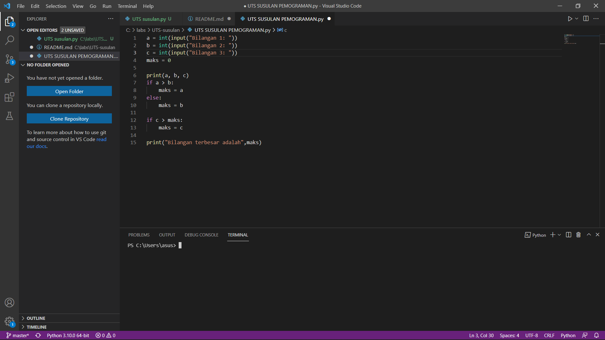
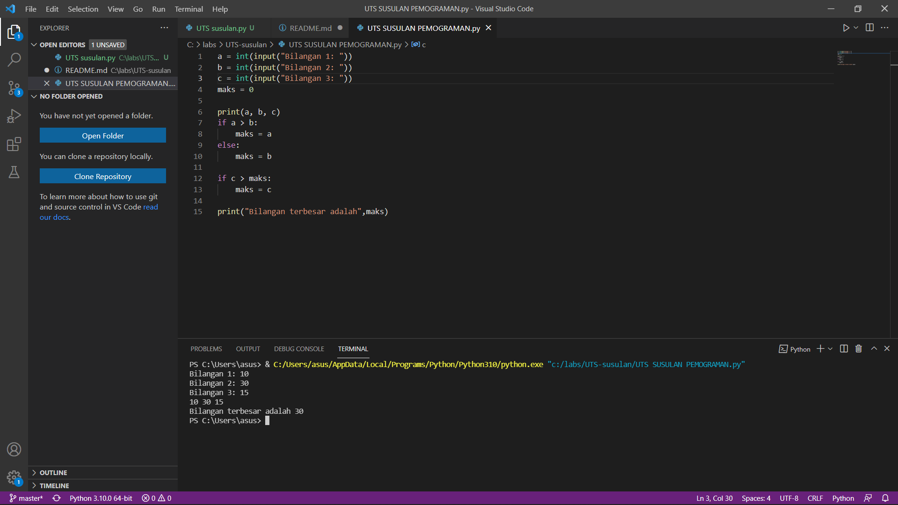

# UTS-susulan

# menentukan bilangan terbesar dari 3 buah bilangan
## Menggunakan statement if, untuk mencari nilai dari 3 buah bilangan7
### Disini saya menginisialisasikan "a" sebagai bilangan pertama, "b" sebagai bilangan kedua, "c" sebagai bilangan ketiga.
### Dengan cara statement if untuk "a" sebagai bilangan pertamma, else untuk "b" sebagai bilangan kedua, if untuk "c" sebagai bilangan ketiga, dan else jika false atau salah, maksudnya jika inputan user di luar program, dia akan menampilkan ini.

##### berikut bentuk program yang saya buat

### dan berikut adalah hasil pemogramannya

